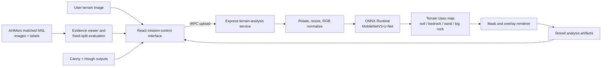

# MARSBOUND

> **Evidence-first Mars terrain intelligence for landing-site exploration.**

MARSBOUND is a hackathon prototype that turns Mars terrain imagery into inspectable computer-vision and semantic-terrain evidence. A user can upload a PNG, JPEG, or WebP terrain image, inspect a terrain-class prediction and overlay, and review the evidence alongside classical edge/circle analysis and an illustrative landing-zone assessment.

The project is designed to show **how an AI result becomes a reviewable mission artifact**, rather than presenting a single unexplained “safe to land” answer.

## The problem

Landing-site assessment is not one classification task. A mission team needs to inspect the source imagery, understand where the model sees soil, bedrock, sand, and big rocks, and keep uncertainty visible before using those signals in any wider decision process.

MARSBOUND addresses that interaction problem with an evidence-first workflow:

1. **Acquire terrain imagery.** Load a demo image or upload a Mars terrain image.
2. **Inspect classical vision.** Review Canny edge and Hough-circle evidence separately from model output.
3. **Segment terrain.** Run the uploaded image through a trained four-class semantic segmentation model.
4. **Review evidence.** Compare the source image, terrain mask, colored overlay, matched AI4Mars labels, and archived error plates.
5. **Discuss a landing decision.** Keep the terrain result as one transparent input—not a replacement for mission engineering.

## What we built

| Component | What it does |
|---|---|
| Mission-control interface | A responsive React interface for terrain acquisition, evidence review, labelled samples, prediction output, and landing-zone discussion |
| Classical CV evidence | OpenCV Canny edge maps and Hough circle candidates for interpretable texture/feature inspection |
| Semantic terrain model | A MobileNetV3-Small encoder with a U-Net-style decoder that predicts soil, bedrock, sand, and big-rock terrain classes |
| Server inference | A TypeScript/Express service that preprocesses uploads, executes an ONNX model on CPU, renders mask/overlay PNGs, and stores analysis artifacts |
| Evaluation gate | A fixed training/validation/test protocol that refuses to promote a model if rare-hazard performance regresses |
| Evidence viewer | Matched AI4Mars MSL images and semantic labels with pixel inspection, class legend, source/overlay/mask modes, and archived disagreement examples |

## Model and honest results

The active server model is **`ai4mars-msl-mobilenetv3-unet-v1`**. It starts with an ImageNet-pretrained MobileNetV3-Small visual encoder and uses a U-Net-style decoder for four-class terrain segmentation. It was trained using **1,900** directly matched AI4Mars MSL rover-image/label pairs, with **300** images used only for validation and a different **300** images kept untouched for the final promotion decision.

> We did **not** claim that the model was trained from scratch. We fine-tuned a segmentation system that uses a pretrained MobileNetV3 visual encoder, then integrated the validated result into the web application.

| Fixed 300-image held-out test metric | Retired v3 prototype | MobileNetV3-U-Net v1 |
|---|---:|---:|
| Pixel accuracy | 35.93% | **82.02%** |
| Macro F1 | 33.16% | **81.75%** |
| Soil F1 | 45.34% | **83.11%** |
| Bedrock F1 | 23.89% | **83.26%** |
| Sand F1 | 28.90% | **78.49%** |
| Big-rock F1 | 34.51% | **82.15%** |

The promotion condition required higher macro F1 **and** no decline in sand or big-rock F1. The new model passed all three conditions. These are scores on the fixed AI4Mars test partition—not an accuracy promise for an arbitrary new upload or a real landing mission.

## System architecture



## Demo script for a hackathon judge

Start with this short walkthrough:

1. **“MARSBOUND is a Mars landing-site intelligence prototype focused on evidence, not a black-box go/no-go decision.”**
2. Upload a terrain image or use a provided Mars sample, then click **Analyze terrain**.
3. Switch between the source, server prediction, and overlay views. Point out the four terrain classes and the visible class-count breakdown.
4. Open the matched-label section to show real AI4Mars source/mask evidence and pixel-level inspection.
5. Explain that the old prototype error plates remain in the UI as archived evidence; the live server uses the promoted MobileNetV3-U-Net.
6. Close with the fixed-split result: **82.02% pixel accuracy, 81.75% macro F1, 78.49% sand F1, and 82.15% big-rock F1**—while emphasizing that this is research decision support, not flight clearance.

## Local development

### Requirements

- Node.js 22+
- pnpm 10+
- A MySQL/TiDB-compatible database and object storage configuration when running outside the Manus project environment

### Run the application

```bash
pnpm install
pnpm dev
```

The project uses a React + Vite client and a TypeScript/Express tRPC server. Production server inference uses `onnxruntime-node`; the ONNX model and its external weight file are located under `server/models/` and are copied into `dist/models/` during the production build.

### Quality checks

```bash
pnpm test
pnpm check
pnpm build
```

The test suite checks the model contract and ONNX runtime execution. The upload-flow browser script is available at `scripts/test_upload_flow.mjs` when a compatible environment and a sample Mars image are available.

## Repository map

```text
client/src/pages/Home.tsx       MARSBOUND mission-control experience
server/segmentation.ts          Upload preprocessing, inference output rendering, and storage
server/segmentationModel.ts     ONNX runtime model contract and terrain-class decoding
server/models/                  Production MobileNetV3-U-Net ONNX artifact and weights
server/routers/segmentation.ts  Typed tRPC analysis endpoint
docs/semantic_model_evaluation.md  Reproducible test protocol, metrics, and limitations
scripts/test_upload_flow.mjs    Desktop/mobile upload-flow validation
```

## Limitations

MARSBOUND is a **research and hackathon prototype**. Its semantic model was evaluated on a fixed AI4Mars MSL image split; that does not establish performance across every Mars camera, lighting condition, terrain type, or future mission. Terrain pixels are also only one part of a landing assessment. Slope, vehicle dynamics, trajectory, thermal conditions, communications, uncertainty calibration, and mission rules require separate engineering analysis.

Accordingly, MARSBOUND always treats the terrain result as **inspectable decision-support evidence**, not autonomous flight-qualified landing clearance.

## Dataset acknowledgement

The training and evaluation work uses AI4Mars matched MSL imagery and terrain masks. Please consult the dataset’s terms, attribution guidance, and label limitations before reusing its data.[1]

## Further technical detail

See [the semantic model evaluation record](docs/semantic_model_evaluation.md) for the exact split protocol, candidate configuration, held-out metrics, deployment contract, and limitations.

## Reference

[1] [NASA Open Data Portal, *AI4MARS: A Dataset for Terrain-Aware Autonomous Driving on Mars*](https://data.nasa.gov/dataset/ai4mars-a-dataset-for-terrain-aware-autonomous-driving-on-mars)
